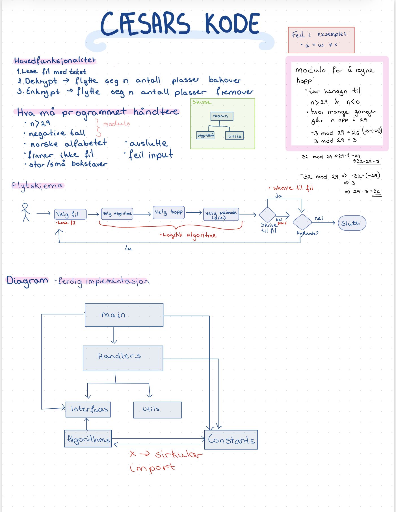
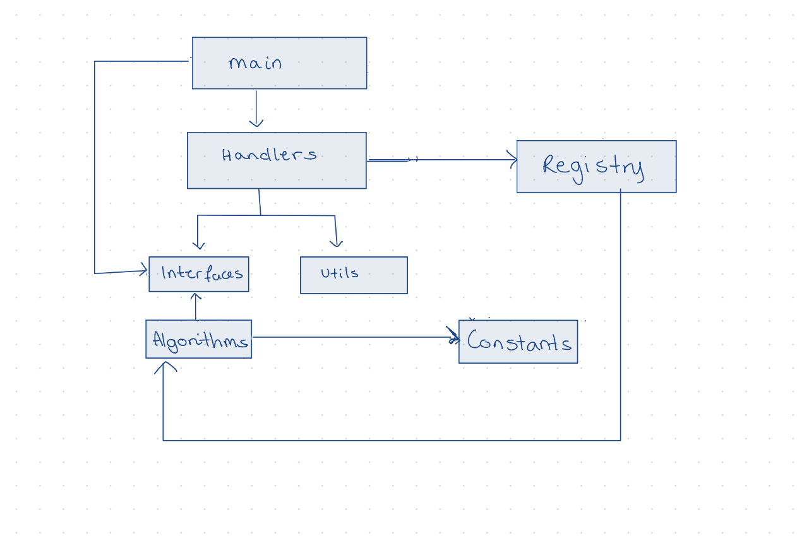

# KrypteringsOppgave

Programmet kan dekryptere og kryptere en testfil ved hjelp av  cæsars kode. Det er lagt vekt på å lage en skalerbarløsning, hvor man enkelt kan legge til nye algoritmer i algorithms. Handlers og main må likevel omstruktureres litt med tanke på bruk av hopp/skift. Ikke alle type krypteringsalgoritmer bruker hopp.
- Støtter kryptering med norske bokstaver

## Kom i gang
Krever python 3.9 eller nyere.
```bash
python main.py
```
## Funksjonalitet og flyt
Når programmet starter opp vil brukeren får en rekke valg:
1. Velg fil - hvor brukeren må velge riktig filsti
2. Velg algoritme - brukeren får en liste med tilgjenglige algoritmer
3. Velg antall hopp - håndterer negative og tall høyere enn 29
4. Velg mellom dekryptering eller kryptering - taster inn d eller e.
5. Velg om resultatet skal skrives til fil - skrives til opprinnelig fil
6. Velg om de vil starte på nytt eller avslutte programmet - ved ny runde starter på 1.

Brukeren kan når som helst avslutte programmet ved å skrive ```Q```.

## Videreutvikling
Kan enkelt legge til nye algoritmer i algorithms mappen, som arver klasser fra algorithms interfacet. Ved videreutvikling må det likevel gjøre noe med user_input, da den nå alltid spør om antall hopp. Dette er stemmer ikke for alle type algoritmer. 

## Skisser fra arbeidsprosessen

